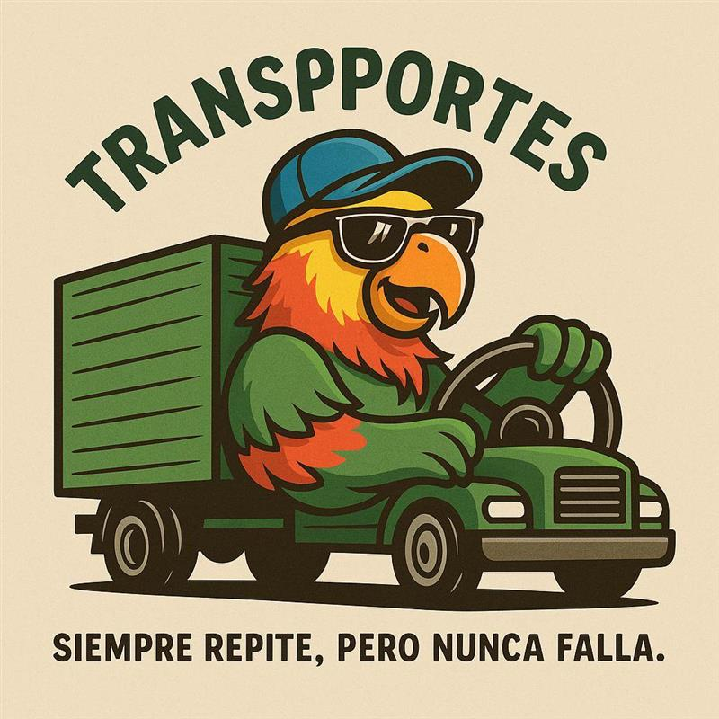

# 🎯 FastDL para la comunidad de CHorrillos Servers [FFA-DM-MIX]
 

 
Este repositorio contiene los archivos necesarios para implementar un servidor **Fast Download (FastDL)** para **Counter-Strike 1.6**, facilitando la descarga rápida de mapas, modelos, sonidos y otros recursos personalizados al conectarse al servidor.
 
---
 
## ✅ ¿Qué es FastDL?
 
FastDL permite a los jugadores descargar recursos a través de **HTTP**, en lugar del protocolo lento HLDS. Esto reduce el tiempo de carga y mejora la experiencia en tu servidor.
 
---
 
## 📂 Estructura del repositorio
 
Organiza los archivos igual que en tu servidor HLDS:

---

## 📞 Contacto
Si tienes dudas, sugerencias o necesitas soporte:

💬 Discord: tuserver.com/cs16

✉️ Correo: tuemail@ejemplo.com

📁 Abre un Issue: [github.com/fcastilm/fc01-fastdl/issues](https://github.com/fcastilm/fc01-fastdl/issues)
<!--
---

## 🦜 OSCO CHUPALA
## 🧠 Créditos
Este repositorio está diseñado para comunidades que desean ofrecer una mejor experiencia de descarga en servidores CS 1.6.
-->
---

## 🦜 Transportes LORO
Un agradecimiento para transportes loro y su gerente general Frank John Osco Balta Quiros Suarez

<!-- -->

